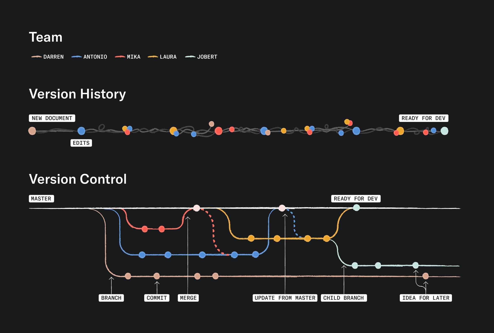

# Introduction to Git and Version Control

---

## Explanation of version control

- **Version Control**: A system that allows you to keep track of changes made to a project over time.
- Enables multiple people to work on the same project simultaneously, without conflicts.
- Facilitates collaboration, rollbacks, and access to different versions of the project.

---

## What is Git?

- Git is a specific version control system that was created by Linus Torvalds in 2005.
- It is widely used in software development and has since become the most popular version control system available.
- The name "git" was given by Linus Torvalds when he wrote the very first version. He described the tool as "the stupid content tracker".

---

## Basic Git Terminology

- **Repository**: A container where all the files of a project are stored, along with their history.
- **Commit**: A save point of the project, that records the changes made at a specific time.
- **Branch**: A separate copy of the project, that allows you to work on new features without affecting the main version of the project.
- **Merge**: The process of integrating changes from one branch into another.

---

## Version History != Version Control

---

## Exercise [20 minutes]

- A visual walk-through of the key concepts.
- As a group, work your way through [A Grip on Git](https://agripongit.vincenttunru.com/) and discuss what's happening at each step.
